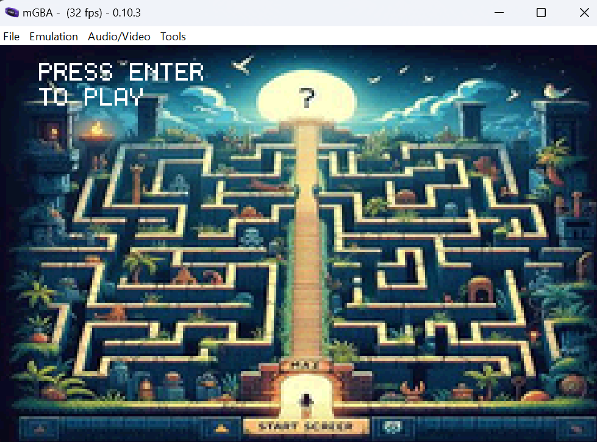
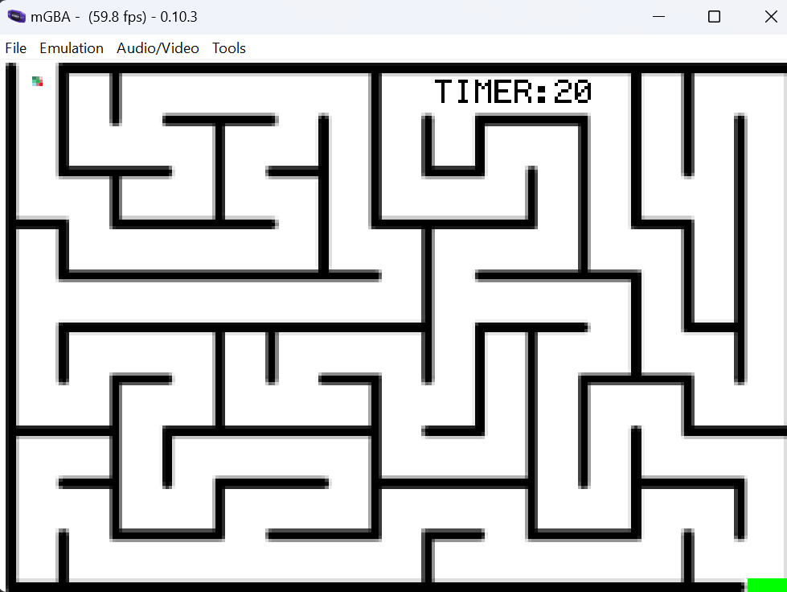
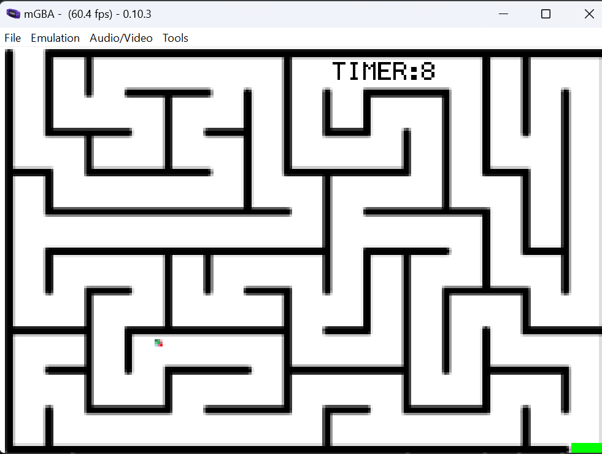
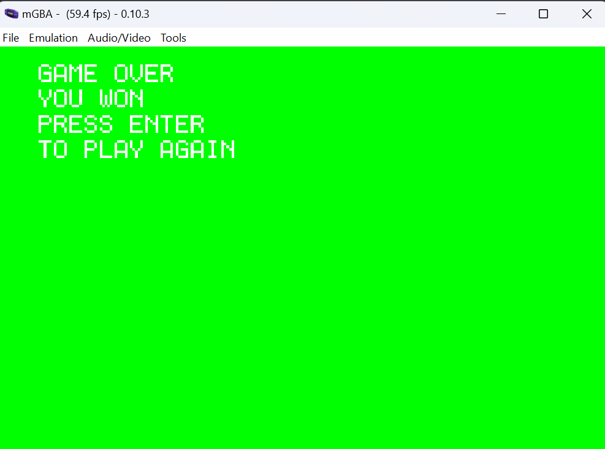
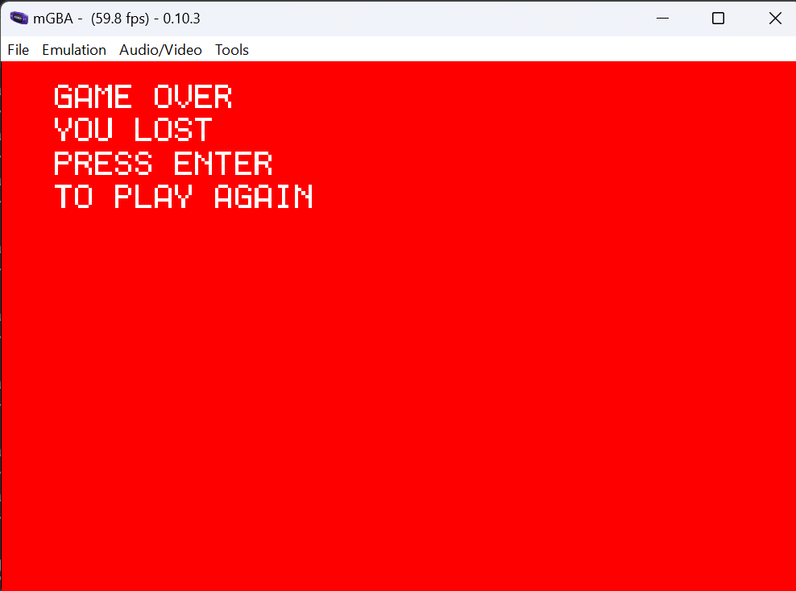

# THE MAZE GAME

This maze game starts with your avatar in the top left corner and you must transport it across the maze to the bottom right corner. However, the entire maze collapses in 20 seconds! Can you protect your avatar before the whole maze collapses on them? 


Find out now in THE MAZE GAME!
```
Type "Enter" key to start the game.
Type "Backspace" key to restart the game.
Player is controlled by Arrow keys.
```
### Features

3 Distinct Images drawn with DMA 
 - Starting Scene Background
 - Maze Background
 - Avatar

Button Input for 2D Movement of Avatar Image using DMA \
Object Collision between Avatar and Maze Walls and Finish \
Timer drawn using pixels on screen

### Images from Game: 
Starting Screen: \
 \
Maze Start: \
 \
Maze Mid Game: \
 \
Won: \
 \
Loss: \
 

Title Screen Art made by AI.  \
Maze created by https://mazesforfun.com/maze-generator \
Avatar created by me. 
